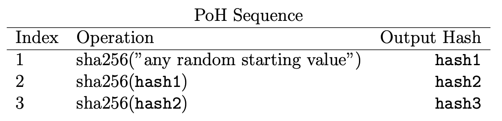
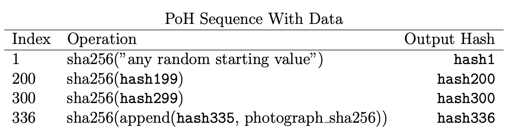

# Solana's Proof of History

Blockchains are known to have a consensus system to achieve agreement between nodes.
The classic approach is Proof of Work, where every node does some heavy computation, usually
involving a cryptographic algorithm, and once the specified condition is met (e.g.: the output has N consecutive zeroes),
they produce a new block, receive their reward and the chain can move forward.
Solana goes in a different direction, the system is designed with performance and parallelism in mind.
There are many properties, modules and systems inside of it that guarantee its speed.
We are going to focus today on Proof of History.

## High-level Overview

Proof of History is a mechanism where Leader nodes (block producers) generate a sequence of hashes,
using the SHA256 algorithm, where a hash depends on the previous one:



There could also be data mixed in the hashes, such as transactions, here's an example:



> Images above were taken from [Solana's whitepaper](https://solana.com/solana-whitepaper.pdf)

A question one may ask is: "Why does it create so many hashes, why not just one?".
The answer is that, with a cryptographically safe hashing function, we can assume
each operation takes constant time, so we can derive a sound clock with which we
can sync the system. This is used as a Verifiable Delay Function (VDF), which makes
it difficult for attackers to precompute future hashes, and it creates a quantifiable
passage of time, a _tick_.

The tick is Solana's time unit built from producing a sequence of hashes, where some
may contain mixins (e.g.: transactions). Solana also has slots, which are a sequence of
ticks. Each of those slots is chosen ahead of time by a leader node to be generated.
The core idea behind Proof of History is to have a verifiable clock, allowing nodes to
avoid communicating with each other.

## Internals

By reading the oficial implementation of the [Proof of History module](https://github.com/solana-labs/solana/blob/d0b1f2c7c0ac90543ed6935f65b7cfc4673f74da/poh) over two days, this is what I've been
able to grasp.

The main structures/components of this module are: `PohService`, `PohRecorder` and `Poh` (is actually elsewhere
but its crucial here). The first creates a thread with an infinite loop where it calls `PohRecorder::tick`, and
this will call a method of the same name in `Poh`. Here's a simplified version in Python.

```python
class PohService:
    def run(self):
        while True:
            self.recorder.tick()

class PohRecorder:
    def tick(self):
        self.poh.tick()
        sleep()

class Poh:
    def tick(self) -> str:
        for _ in range(self.remaining_hashes):
            self.curr_hash = hash(self.curr_hash)
        # should also increment/decrement integers
        # about hashes generated/remaining
        return self.curr_hash

# the oficial API has more arguments, this is simplified
service_thread = Thread(handler=PohService.run)
service_thread.join()
```

In each iteration of this loop there's an optimization to see if it really is necessary to call `PohRecorder::tick`.
And inside `PohRecorder::tick` there is a sleep call after `Poh::tick`. The time passed to sleep is used to make each
slot of a fixed time, and the ticks get filled in it proportionally. `Poh` is the one that will generate the
sequence of hashes, the value for `remaining_hashes` (amount per tick) comes from `PohConfig`. The node could
also be in `LOW_POWER_MODE`, where the amount is `u64::MAX`.

The famous 400ms block confirmation time is calculated based of the constants seen in [`sdk/program/src/clock.rs`](https://github.com/solana-labs/solana/blob/d0b1f2c7c0ac90543ed6935f65b7cfc4673f74da/sdk/program/src/clock.rs).
A slot is where a block may fit (generated by a leader node), and the constants are composed together to make each
tick iteration sleep the correct amount of time.

`PohRecorder` also has a `record_receiver` channel to get transactions to be recorded, that's how it has access to them
to include as a mixin in the hashing process. And it will send the records created to the bank and ledger.

## Zig Proof of Concept

In this repository you can find the source code of a Proof of Concept about the ideas described above,
in a simplified way because of time constraints.
The code has similar structures to the Rust ones, but no channels were made to send and receive data
to other components.

There is an experimental branch where I tried replicating the sleep proportional to the time left in
the slot, but I couldn't make it work in time. So the `main` branch has a fixed sleep per tick, unlike
the Solana codebase.

To run it you can use `zig run src/main.rs`, or compile it with `zig build` then run with `./zig-out/bin/zoh`.
Here's an example output to see what's happening internally:

```
start
tick
new hash
new hash
new hash
new hash
new hash
reset
tick
new hash
new hash
new hash
new hash
new hash
reset
```
